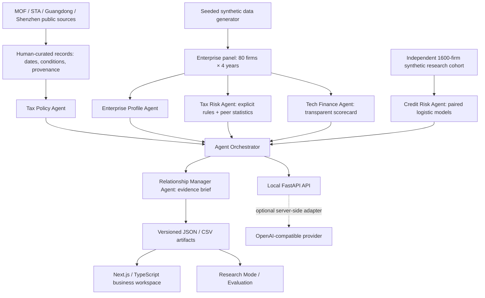

# BankTax-Agent

The public website defaults to Simplified Chinese, including enterprise briefs, policy conditions, risk explanations and charts. The walkthrough, data dictionary and research protocol are also provided in Chinese. This README remains available for English readers.

**Enterprise Tax Intelligence & Bank-Tax Risk Agent**

Transforming tax, financial and innovation signals into explainable intelligence for commercial banking.

[**Launch the public demo**](https://banktax-agent.hklcrgpt.chatgpt.site) · [中文 README](README.md) · [Three-minute walkthrough](docs/demo-script.md) · [Research protocol](docs/research-method.md)


> An independent research and engineering portfolio by **Kun Huang (黄坤)**, built at the intersection of **Tax Economics × Corporate Tax × Banking × AI Agents**. All company names and enterprise-level records are fictional and generated solely for demonstration. No bank affiliation or endorsement.

## Why this project

Corporate relationship managers need to understand more than a company's current profit. Tax records can reveal reconciliation questions, policy-related cash-flow considerations and the persistence of investment in innovation. Those signals need **source provenance, explicit assumptions and a human-review workflow** before they can usefully enter a financing discussion.

BankTax-Agent makes that workflow tangible: a financial and tax digital twin, a deterministic reconciliation engine, an explainable innovation scorecard and a reproducible credit-risk experiment. It is a decision-support prototype, **not a tax chatbot or a production lending system**.

## Live demo

**[Open BankTax-Agent](https://banktax-agent.hklcrgpt.chatgpt.site)** — no installation, registration or API key.

- [Portfolio overview](https://banktax-agent.hklcrgpt.chatgpt.site/#portfolio)
- [High-growth AI company](https://banktax-agent.hklcrgpt.chatgpt.site/#company/P-001)
- [Revenue–VAT reconciliation case](https://banktax-agent.hklcrgpt.chatgpt.site/#risks/P-002)
- [R&D opportunity case](https://banktax-agent.hklcrgpt.chatgpt.site/#company/P-003)
- [Research Mode](https://banktax-agent.hklcrgpt.chatgpt.site/#research)

## Business cases

| Case | Business question | What the system exposes |
|---|---|---|
| Xinglan AI · 深圳星澜智能科技有限公司（虚构） | How should a growing R&D-intensive firm be understood beyond current profitability? | Four-year revenue/R&D trajectory, staff and patent indicators, explicit innovation weights, simulated model outputs and an evidence brief. |
| Chengyuan Industrial · 东莞澄远工业装备有限公司（虚构） | Why do accounting revenue and VAT sales diverge? | A 36% absolute reconciliation gap, rule threshold, possible timing/export/scope explanations and verification steps. No allegation of wrongdoing. |
| Yuntuo Robotics · 深圳云拓机器人有限公司（虚构） | Which innovation policies merit a document review? | R&D deduction, qualification-dependent CIT treatment and advanced-manufacturing VAT leads, with conditions and original sources. |

## Implemented features

| Agent | Responsibility | Evidence / method |
|---|---|---|
| Tax Policy Agent | Retrieve dated official policy records and identify candidate opportunities | Curated keyword retrieval, applicability screening, explicit abstention and original-source links |
| Enterprise Profile Agent | Assemble the enterprise digital twin | 80 fictional firms, 320 FY2022–2025 records, financial/tax/innovation indicators |
| Tax Risk Agent | Surface reconciliation signals | Revenue–VAT, R&D, taxable-income–CIT, invoices, growth divergence, historical and peer cash-tax burden rules |
| Tech Finance Agent | Explain sustained innovation inputs | Six-component innovation scorecard; every formula and weight is visible |
| Credit Risk Agent | Compare conventional and augmented feature sets | Standardized logistic regression, identical held-out enterprises, ROC/calibration/permutation importance |
| Relationship Manager Agent | Compose a concise enterprise evidence brief | What's happening, opportunities, signals to verify and next actions, with an inspectable six-agent trace |

The orchestrator routes supported intents to focused agents. Public demo briefs are **deterministic summaries of computed evidence**, not generated text falsely presented as a live LLM call. The optional browser WebMCP interface exposes read-only enterprise evidence when supported.

## Architecture



**Deployment separation is intentional:** the public site is a Next.js static export hosted through Sites. Python generates auditable demo artifacts offline. Local/Docker FastAPI serves the same evidence, policy retrieval, tax arithmetic and optional live AI. The public host does not run Python or expose an unauthenticated paid-model endpoint. PostgreSQL persistence and production audit infrastructure are roadmap items.

## Screenshots

All screenshots are taken from the actual application by the checked-in browser journey. They are not design mockups.

| Landing | Company 360 |
|---|---|
|  |  |

| Tax risk analysis | Innovation profile |
|---|---|
|  |  |


## Research Mode

**Question:** Do tax and innovation signals improve credit-risk identification beyond conventional financial data?

The experiment uses **1,600 independent synthetic enterprises**, a fixed stratified 70/30 split (**1,120 training / 480 test**), `StandardScaler` fitted only on training data, logistic regression with fixed `C=1`, and a classification threshold of `0.5`. The 80 portfolio companies never enter training or evaluation. Neither labels nor latent propensity enter the feature matrix.

| Held-out metric | A: financial only | B: financial + tax + innovation |
|---|---:|---:|
| ROC-AUC | 0.6714 | 0.7498 |
| Brier score ↓ | 0.1364 | 0.1209 |

Precision, recall, F1, confusion matrices, six-bin calibration, standardized coefficients, ten-repeat held-out permutation importance, feature descriptives and a 500-draw paired bootstrap AUC interval are available in the UI and [complete generated result](evals/results/model-comparison.json).

These are **actual pipeline outputs**, not target metrics. The label-generating process includes tax and innovation variables by assumption. Consequently, a performance difference is conditional on that DGP, **not empirical evidence about real banks, real defaults or a causal effect**. See [the disclosed equation, feature definitions and limits](docs/research-method.md).

## Evaluation

The reproducible deterministic suite currently reports **45 / 45 checks passing**, backed by [per-case results](evals/results/evaluation.json). It measures engine behavior and curated citation provenance; it does **not** report live LLM accuracy or certify legal eligibility.

| Category | Checks |
|---|---:|
| Policy QA: known retrieval and benefit statements | 5 |
| Citation validation: official domain, provenance and conditions | 8 |
| Tax calculation: eligible expensed R&D arithmetic | 6 |
| Risk rules: thresholds, evidence and verification | 10 |
| Agent routing | 6 |
| Hallucination / unsupported-request abstention | 4 |
| Regression: dates, datasets, cases and missing list evidence | 6 |

Additional checks: **44 backend tests**, **9 frontend tests**, TypeScript checking, ESLint, Ruff, production build and a browser journey covering the three cases, unsupported policy queries, calculator, search/empty states and mobile navigation/layout. CI also builds and starts the Docker stack and checks both services. No policy-source network availability rate or real-model accuracy is claimed.

## Synthetic data & policy provenance

- Reproducible generator: [`backend/synthetic.py`](backend/synthetic.py), seed `20261003`; independent research seed `20261004`.
- Financial units: **RMB millions**, ratios in decimal fractions, patents/employees as counts.
- Accounting relationships connect revenue, R&D, expenses, tax-base bridge, VAT input/output assumptions, assets and liabilities. Deliberate reconciliation scenarios are documented; random variation is not a representation of China's firm population.
- [Downloadable panel CSV](public/data/enterprise-panel.csv), [enterprise panel JSON](data/enterprise_panel.json), [research cohort](data/research-cohort.csv), [data dictionary](docs/data-dictionary.md), [hash manifest](data/manifest.json).
- All qualifications, tax-credit grades, government innovation indicators and labels are simulated. Names include `（虚构）`; any resemblance to real companies is coincidental.
- [Eight source records](data/policies.json) distinguish official policy, guidance, notices and directional reports. Snapshot checked **3 October 2026**. The small-scale VAT record uses **2026 No.10**; the archived Shenzhen recognition notice is excluded from active matching after its final **4 September 2026** batch deadline.
- FY2025 enterprise tax data and the October 2026 opportunity snapshot have different time roles. Later policy opportunities are never applied retrospectively to generated FY2025 taxes.
- External government sites can change or block automated requests. The source catalog is auditable; this release does not continuously ingest or monitor policy changes.

## Quick start

Prerequisites: Node.js 24 and Python 3.11. No model credentials are needed for the demo.

```bash
npm ci
npm run dev
# http://127.0.0.1:3000
```

The generated demo artifacts are committed, so frontend-only visitors do not need Python. To rebuild the dataset, train the models, evaluate or run the API:

```bash
python -m venv .venv
# Windows PowerShell:
.venv\Scripts\Activate.ps1
# macOS / Linux:
# source .venv/bin/activate
pip install -r requirements.lock.txt
python -m backend.pipeline
python -m evals.run
uvicorn backend.api:app --host 127.0.0.1 --port 8000
# OpenAPI: http://127.0.0.1:8000/docs
```

### Live AI mode

Copy `.env.example` to `.env` locally and configure only the server:

```dotenv
ENABLE_LIVE_AI=true
OPENAI_API_KEY=your-server-side-key
OPENAI_BASE_URL=https://your-compatible-provider.example/v1
OPENAI_MODEL=your-model-name
NEXT_PUBLIC_API_BASE_URL=http://127.0.0.1:8000
```

Restart the API and frontend after configuration. `NEXT_PUBLIC_API_BASE_URL` contains only a public endpoint URL; **never** put credentials in a `NEXT_PUBLIC_*` variable. All calls go through [`backend/llm.py`](backend/llm.py). The adapter uses a bounded structured brief, validates evidence IDs, rejects unsupported output and preserves deterministic fallback access. Provider integration tests use mocks; no paid live call is made during public deployment. Semantic correctness still requires human review.

### Tests and build

```bash
python -m pytest
ruff check backend tests evals
python -m evals.run
npm run lint
npm run typecheck
npm test
npm run build
```

For browser tests, serve the built export in one terminal and run the journey in another:

```bash
python -m http.server 3000 --directory out --bind 127.0.0.1
# second terminal:
npx playwright install chromium
npm run test:e2e
```

`DEMO_TEST_URL` optionally changes the test target. Screenshots are saved to `docs/screenshots/`; raw browser reports and failure traces are ignored by Git.

## Docker

```bash
docker compose up --build
```

Open **http://localhost:8080** (web) and **http://localhost:8000/docs** (API). The API port is bound to loopback. Leave `.env` empty for deterministic mode. The API image runs as an unprivileged user. `docker compose down` stops the stack.

Docker was unavailable on the author's Windows machine during creation; container build/start verification is performed in the Linux CI job. The public static demo does not depend on Docker.

## Project structure

```text
app/                   Next.js static-export workspace
components/            Business, policy, company and research views
lib/domain.ts          Frontend filtering, policy retrieval and formatting
backend/               Synthetic data, rules, agents, models, API and LLM adapter
data/                  Source catalog, enterprise panel, research cohort, manifest
public/data/           Browser-ready artifacts and downloadable panel
evals/                 Deterministic suite and actual run results
tests/                 Backend, frontend and browser tests
docs/                  Demo script, research protocol, data dictionary, screenshots
deploy/                Static-server configuration
.github/workflows/     Test, lint, build, browser and Docker CI
```

## Limitations & roadmap

This release has a fixed policy snapshot, illustrative heuristics and no production identity, authorization, distributed rate limiting or real enterprise-data ingestion. The innovation score is an explicit design choice, not an accredited rating. Cash-tax burden is not a statutory effective tax rate. The model's simulated outcome probabilities are not real-world PD estimates.

Future work: versioned ingestion with stronger source/content checks; multilingual semantic retrieval with an evaluated abstention policy; authorized real-data validation; PostgreSQL audit persistence; prospective, temporal and external model validation; production access controls, monitoring and cost protection. None of these is represented as implemented.

## Security, privacy & disclaimer

See [SECURITY.md](SECURITY.md). The demo uses synthetic enterprise-level data, no proprietary bank data and no personal financial information. It makes no production lending decisions or automatic tax/legal conclusions. Human review is required. Credentials are supplied through environment variables and excluded from Git.

**Decision-support prototype. Alerts indicate signals requiring further verification and do not constitute tax, credit, legal, or compliance conclusions.** No real bank, enterprise, client, cooperation agreement, performance claim or user count is implied.

## License & author

Code and synthetic data: [MIT License](LICENSE). Public policy documents remain attributed to their original government publishers; no ownership of those source documents is claimed.

**Kun Huang / 黄坤** · Public Finance / Economics PhD candidate, Wuhan University.
[GitHub](https://github.com/beibeihk) · [Research blog](https://beibeihk.github.io/myblog/)
