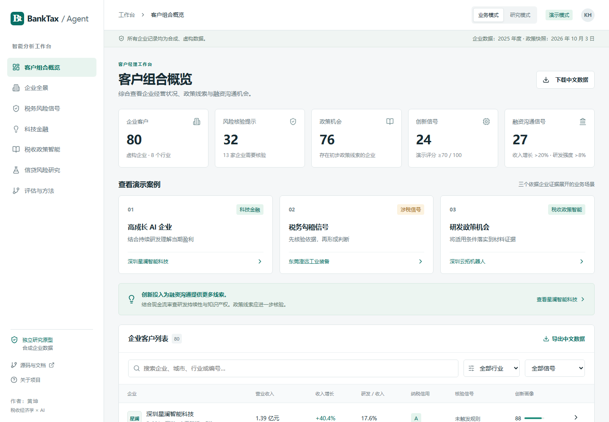
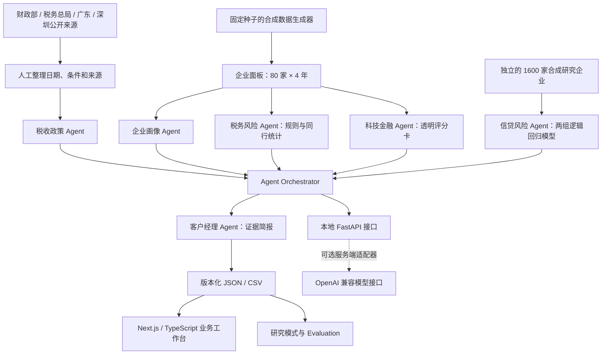
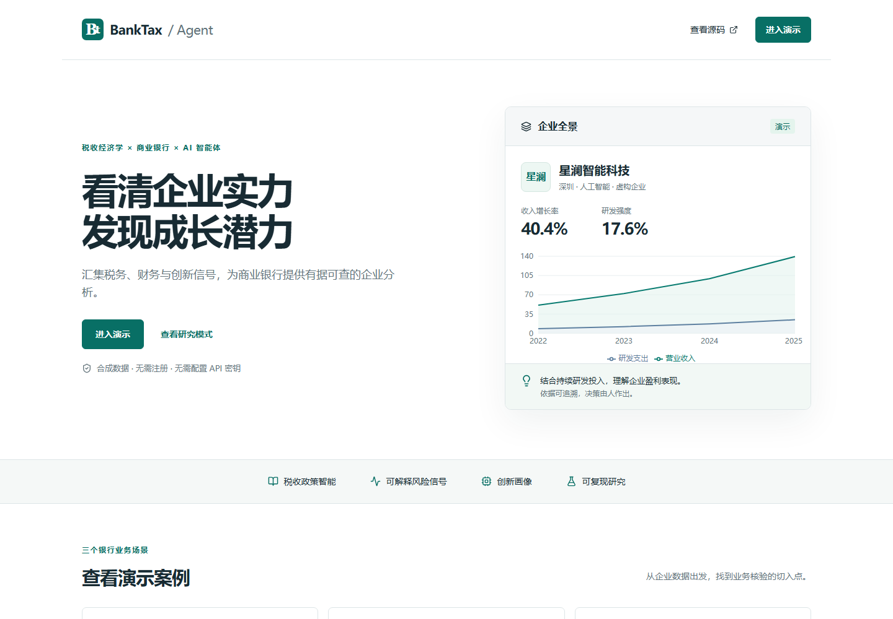
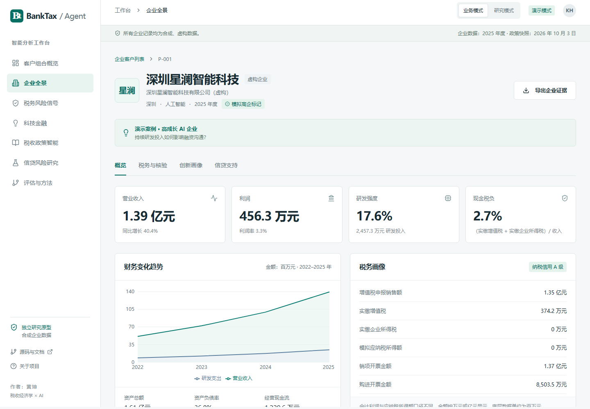
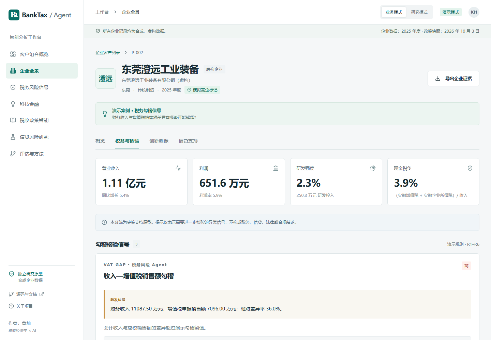
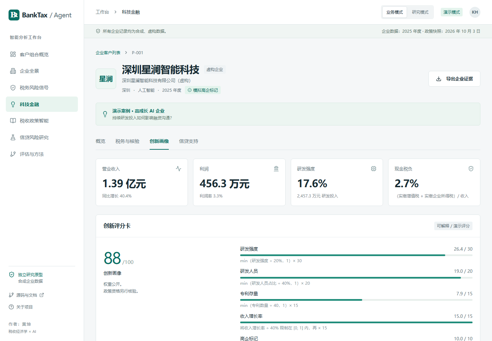
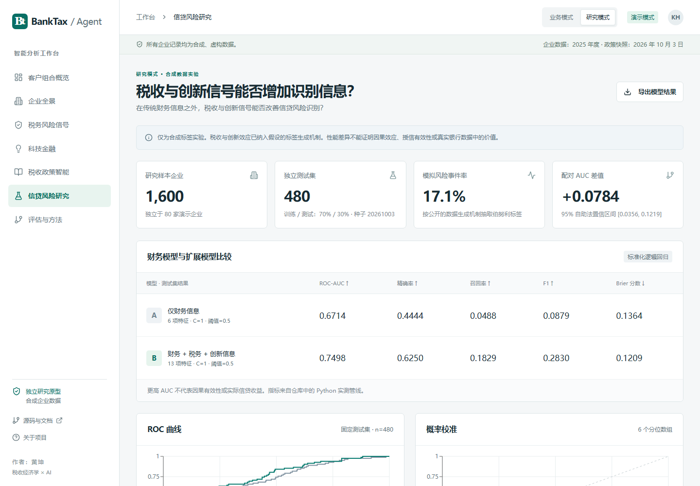

# BankTax-Agent

**面向商业银行对公业务的企业涉税智能、科技金融识别与风险决策支持系统**

将企业税收、财务与创新信号转化为有依据、可解释、可核验的银行业务信息。

[**直接打开公开演示网站**](https://banktax-agent.hklcrgpt.chatgpt.site) · [English README](README.en.md) · [面试演示脚本](docs/demo-script.md) · [研究方法与边界](docs/research-method.md)




> 黄坤（Kun Huang）的独立科研与工程作品，结合 **财政税收 × 企业财务 × 银行业务 × AI Agents**。全部企业名称和企业级记录均为演示生成的虚构数据，不包含银行内部数据或真实客户资料，与任何银行无隶属、合作或官方背书关系。

## 为什么做这个项目

商业银行对公客户经理需要了解的不只是企业当前利润。企业税收信息可以为财税勾稽核验、政策相关现金流分析和持续创新投入识别提供线索。但这些信息只有具备明确来源、适用条件和人工核验流程，才能进入可靠的融资讨论。

BankTax-Agent 将这一业务流程做成可体验的产品原型：从企业财税画像出发，通过规则引擎识别需要核验的异常信号，结合透明的创新评分卡与政策依据，生成客户经理证据简报；研究模式则用可复现的合成数据实验比较不同信息集的风险识别表现。

目标使用者包括银行对公客户经理、风险经理、科技金融研究人员及相关招聘评审人员。系统提供决策支持，不形成实际授信、税务或法律结论。

## 公开网站与分享方式

**网站地址：[https://banktax-agent.hklcrgpt.chatgpt.site](https://banktax-agent.hklcrgpt.chatgpt.site)**

网站已设为公开访问。朋友、同事和招聘人员可以直接打开，无需注册、安装软件或填写 API 密钥，电脑和手机均可体验。网站默认采用简体中文，导航、企业画像、证据简报、风险解释、政策条件、图表和研究说明均已中文化。README、演示脚本、数据字典与安全说明也使用中文；另提供英文 README。

建议先进入客户经理工作台，再依次打开三个预置案例：

- [客户经理工作台](https://banktax-agent.hklcrgpt.chatgpt.site/#portfolio)
- [案例一：高成长 AI 企业](https://banktax-agent.hklcrgpt.chatgpt.site/#company/P-001)
- [案例二：收入与增值税销售额核验](https://banktax-agent.hklcrgpt.chatgpt.site/#risks/P-002)
- [案例三：研发与科技企业政策线索](https://banktax-agent.hklcrgpt.chatgpt.site/#company/P-003)
- [研究模式：模型比较与可解释性](https://banktax-agent.hklcrgpt.chatgpt.site/#research)

可随链接附上这段介绍：

> 这是我开发的 BankTax-Agent 银行对公业务原型，可以查看企业财税画像、科技创新投入、政策线索及需要进一步核验的异常信号。里面有三个可以直接体验的案例，所有企业和数据均为虚构，打开网页即可使用。

## 三个完整业务案例

| 案例 | 银行业务问题 | 可以看到什么 |
|---|---|---|
| 深圳星澜智能科技有限公司（虚构） | 如何理解研发密集、高成长、当前利润率较低的科技企业？ | 四年收入与研发轨迹、研发人员和专利指标、透明创新评分、模拟模型输出与客户经理简报。 |
| 东莞澄远工业装备有限公司（虚构） | 财报收入与增值税销售额为什么存在差异？ | 36% 的绝对勾稽差异、触发规则、时间性差异/出口/合并范围等可能正常原因，以及进一步核验步骤。 |
| 深圳云拓机器人有限公司（虚构） | 哪些研发或科技企业政策值得进一步核实？ | 研发费用加计扣除、高企资格相关所得税政策、先进制造业增值税政策线索，附适用条件和官方来源。 |

政策匹配表示候选线索，不代表已满足法定条件、已获得优惠或贷款资格。异常信号不代表企业违法或必然违约。

## 已实现的功能与六类 Agent

| Agent | 业务职责 | 数据依据或方法 |
|---|---|---|
| 税收政策 Agent | 检索有日期的官方政策记录，识别候选政策机会 | 小规模精选政策库、关键词检索、适用条件筛查、来源追溯和证据不足时弃答 |
| 企业画像 Agent | 组装企业数字画像 | 80 家虚构企业、320 条 FY2022–2025 年度记录，涵盖财务、税务和创新指标 |
| 税务风险 Agent | 提示需要进一步核验的财税勾稽信号 | 收入—VAT、研发投入、所得税税基—缴款、发票、增长背离、历史与模拟同行现金税负规则 |
| 科技金融 Agent | 解释企业持续创新投入 | 六项创新评分卡，逐项显示公式、权重、得分及局限 |
| 信贷风险 Agent | 比较传统财务信息与涉税/创新信息的模拟识别表现 | 标准化逻辑回归、相同测试样本、ROC、校准及置换特征重要性 |
| 客户经理 Agent | 形成企业证据简报 | 企业现状、政策线索、待核验信号、下一步行动与六类 Agent 的证据轨迹 |

Agent Orchestrator 负责将支持的问题分派到对应业务 Agent。公开演示中的简报是基于实际计算结果生成的**确定性证据摘要**；本地后端另提供可选 Live AI 接口。支持 WebMCP 的浏览器还可读取企业证据。

## 系统架构



公网网站采用 Next.js 静态导出，由 Sites 托管；Python 在离线流程中生成可审计的演示数据和模型结果。本地或 Docker 中的 FastAPI 提供企业证据、政策检索、税务计算及可选 Live AI。公网演示不运行 Python 服务，不暴露付费模型接口。PostgreSQL 和生产审计基础设施属于后续工作。

## 真实页面截图

以下六张截图均由项目内的自动化浏览器流程从实际应用获取。

| 产品首页 | 企业全景画像 Company 360 |
|---|---|
|  |  |

| 税务异常信号 | 科技创新画像 |
|---|---|
|  |  |



## 研究模式：税收与创新信息能否增加识别能力？

**研究问题：在传统财务数据之外，税收和创新信号是否有助于识别信贷风险？**

实验使用独立的 **1,600 家合成企业**，固定、分层的 70/30 训练—测试分割：训练 1,120 家、测试 480 家。`StandardScaler` 仅在训练集拟合；两模型采用固定 `C=1` 的逻辑回归，分类阈值为 0.5。工作台的 80 家企业不参与训练或评估，标签和潜在风险概率不进入特征矩阵。

| 留出测试集实际运行指标 | 模型 A：仅财务 | 模型 B：财务 + 税收 + 创新 |
|---|---:|---:|
| ROC-AUC | 0.6714 | 0.7498 |
| Brier Score（越低越好） | 0.1364 | 0.1209 |

页面同时展示 Precision、Recall、F1、混淆矩阵、六组校准、标准化系数、10 次重复的留出集置换重要性、特征描述统计及 500 次成对 Bootstrap AUC 差异区间。[完整生成结果](evals/results/model-comparison.json)和[研究方法说明](docs/research-method.md)可供核查。

**这些数值来自实际运行，但标签生成过程按假设包含了税收和创新变量。表现差异只说明该模拟设定下的方法，不能作为真实企业违约、银行授信有效性或因果关系的实证证据。**

## Evaluation、测试与持续集成

确定性 Evaluation 实际执行结果为 **45 / 45 项通过**。[逐项结果](evals/results/evaluation.json)检查业务引擎行为和精选引用的来源信息，不衡量真实大模型准确率，也不认证法定优惠资格。

| 检查类别 | 项数 |
|---|---:|
| 政策问答：已知检索与优惠表述 | 5 |
| 引用核验：官方域名、来源与条件 | 8 |
| 税务计算：合格费用化研发支出算术 | 6 |
| 风险规则：阈值、证据与核验步骤 | 10 |
| Agent 路由 | 6 |
| 无依据请求的弃答检查 | 4 |
| 回归检查：日期、数据、案例及缺失名单证据 | 6 |

此外，**44 项后端测试、9 项前端测试**、TypeScript 检查、ESLint、Ruff、生产构建和浏览器流程均已通过。浏览器流程覆盖三个案例、无依据政策请求、计算器、搜索空状态以及移动端导航与布局。GitHub Actions 还实际构建并启动 Docker 双服务，检查网站及 API。公网版本已通过未登录浏览器会话的相同主要流程。

## 合成数据与政策来源

- 数据生成器：[`backend/synthetic.py`](backend/synthetic.py)。演示种子 `20261003`，独立研究种子 `20261004`。
- 企业覆盖 AI、软件、半导体、机器人、先进制造、跨境贸易、传统制造和精密仪器等行业。
- 金额单位为**人民币百万元**；比例采用小数，专利和员工采用数量。
- 收入、研发、利润、税基调整、增值税进销项假设、资产负债等具有明确关系；专门设置了勾稽差异案例。数据不代表中国企业总体分布。
- 所有资质标记、税收信用等级、政府创新指标和风险标签均为模拟。企业名附有 `（虚构）`，与真实企业重名属巧合。
- 可下载：[中文企业面板 CSV](public/data/enterprise-panel.zh-CN.csv)、[原始字段 CSV（用于代码复现）](public/data/enterprise-panel.csv)、[企业面板 JSON](data/enterprise_panel.json)、[研究样本](data/research-cohort.csv)、[数据字典](docs/data-dictionary.md)、[哈希清单](data/manifest.json)。中文 CSV 使用中文表头、行业、城市与布尔标记，保留相同数值和百万元单位。
- [8 条公开来源记录](data/policies.json)区分正式政策、指南、通知和方向性报告，核验快照日期为 **2026 年 10 月 3 日**。
- 小规模纳税人 VAT 记录采用 2026 年第 10 号公告。深圳高企认定通知最后批次于 2026 年 9 月 4 日结束，作为历史材料保留，已排除当前机会匹配。
- FY2025 财税数据和 2026 年政策机会快照承担不同时间角色；后续政策不追溯应用于生成的 FY2025 税款。
- 官方网站可能更新或限制自动请求。本版本提供可审计的来源目录，尚未持续采集或监测政策变化。

## 本地快速启动

环境要求：Node.js 24、Python 3.11。公开演示与本地前端无需模型凭据。

```powershell
npm ci
npm run dev
# 打开 http://127.0.0.1:3000
```

演示数据已提交到仓库，仅运行前端时不需要 Python。重新生成数据、训练模型、评估或运行 API 时：

```powershell
python -m venv .venv
# Windows PowerShell：
.venv\Scripts\Activate.ps1
# macOS / Linux 改用：source .venv/bin/activate
pip install -r requirements.lock.txt
python -m backend.pipeline
python -m evals.run
uvicorn backend.api:app --host 127.0.0.1 --port 8000
# API 文档：http://127.0.0.1:8000/docs
```

<a id="live-ai-mode"></a>

### 可选 Live AI 模式

本地将 `.env.example` 复制为 `.env`，在服务端配置：

```dotenv
ENABLE_LIVE_AI=true
OPENAI_API_KEY=your-server-side-key
OPENAI_BASE_URL=https://your-compatible-provider.example/v1
OPENAI_MODEL=your-model-name
NEXT_PUBLIC_API_BASE_URL=http://127.0.0.1:8000
```

配置后重启 API 和前端。`NEXT_PUBLIC_API_BASE_URL` 仅表示公开接口地址；**任何密钥均不得写入 `NEXT_PUBLIC_*`**。模型调用统一由 [`backend/llm.py`](backend/llm.py) 封装，包含输出长度与结构限制、证据 ID 核验和异常处理。接口测试使用模拟响应，公开部署未进行付费模型调用；真实输出仍需人工审查。

### 测试与构建

```powershell
python -m pytest
ruff check backend tests evals
python -m evals.run
npm run check
```

生产构建完成后，可在一个终端启动静态服务器，在另一个终端执行浏览器测试：

```powershell
python -m http.server 3000 --directory out --bind 127.0.0.1
# 另一个终端：
npx playwright install chromium
npm run test:e2e
```

`DEMO_TEST_URL` 可切换测试目标。真实截图保存在 `docs/screenshots/`；浏览器报告与失败轨迹已排除 Git 提交。

## Docker 部署

```powershell
docker compose up --build
```

网站为 **http://localhost:8080**，API 文档为 **http://localhost:8000/docs**。API 端口仅绑定本机；无需 Live AI 时保留默认确定性配置。API 容器使用非 root 用户。`docker compose down` 停止服务。

创建项目时作者的 Windows 电脑未安装 Docker；容器构建、启动和接口检查已在 Linux CI 中实际通过。公网演示不依赖本地 Docker。

## 项目结构

```text
app/                   Next.js 静态导出应用
components/            客户经理、企业、政策、风险与研究页面
lib/domain.ts          前端筛选、政策检索及格式处理
backend/               合成数据、规则、Agent、模型、API 与 LLM 适配器
data/                  政策目录、企业面板、研究样本及清单
public/data/           浏览器读取与下载的数据文件
evals/                 确定性评估及实际运行结果
tests/                 后端、前端与浏览器测试
docs/                  演示脚本、研究协议、数据字典和截图
deploy/                静态服务器配置
.github/workflows/     测试、检查、构建、浏览器与 Docker CI
```

## 已知局限与后续路线

当前版本使用固定政策快照、说明性规则及合成样本，尚未实现生产身份认证、复杂授权、分布式限流或真实企业数据接入。创新分数采用明确的设计权重，不是认证评级；现金税款与收入之比不是法定有效税率；模拟事件概率不是真实违约概率。

后续工作包括版本化政策采集与内容核验、多语言语义检索及弃答评估、授权真实数据验证、PostgreSQL 审计存储、时间与外部样本验证、生产权限、监控与成本控制。以上内容均未作为当前已实现功能展示。

## 安全、隐私与使用边界

详见 [SECURITY.md](SECURITY.md)。系统仅使用合成企业级数据，不含专有银行数据或个人金融信息，不形成生产授信决定或自动税务/法律结论。所有重要输出均需人工核验，凭据通过环境变量提供并排除 Git 提交。

**本系统为决策支持原型。提示仅表示需要进一步核验的异常信号，不构成税务、信贷、法律或合规结论。** 不暗示任何真实银行合作、真实企业案例、实际用户数量或现实业务绩效。

## 许可证与作者

代码和合成数据采用 [MIT License](LICENSE)。公开政策文件归原发布机构所有，项目保留原始来源署名。

**黄坤 / Kun Huang** · 武汉大学财政学 / 经济学博士研究生。

[GitHub](https://github.com/beibeihk) · [研究博客](https://beibeihk.github.io/myblog/)
